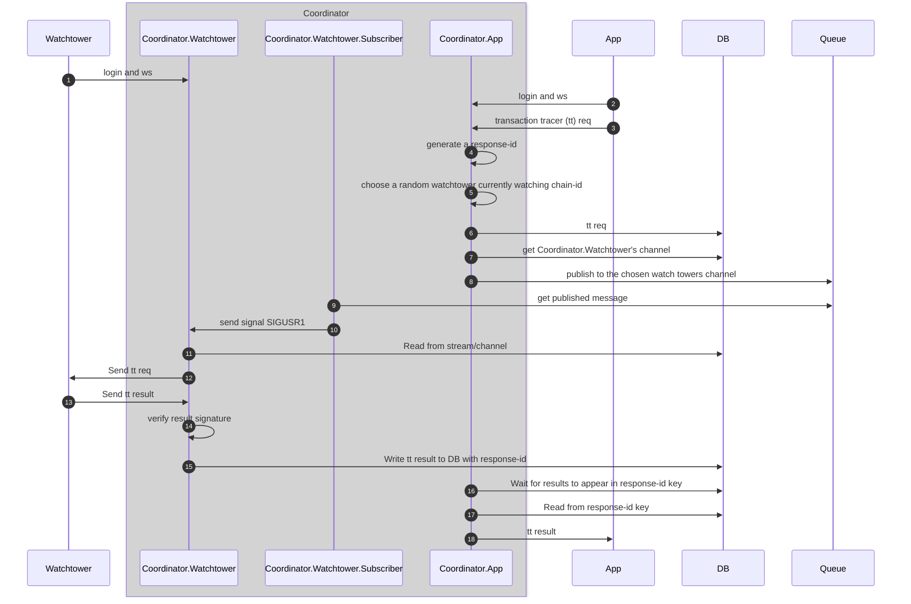

# sdk-python

This module contains all APIs of wintesschain

## Transaction Tracer 

download the file `witnesschain.py` and run `./install-dependencies.sh`

The dependencies are the packages:
```
websockets requests eth_account async_timeout
```

The documentation is in `html/witnesschain.html`

you may refer to the example app in `test-tracer-app.py`
and `test-tracer-watchtower.py` to test/simulate a watchtower.

## Example App for tracing transaction

```
import witnesschain

t = witnesschain.TransactionTracer ({
	"role"		: "app",
	"keyType"	: "ethereum",
	"privateKey"	: "ed9f0b916c7017e4d51edac23c79f5c3cc08107993cce093761e8c52f67e861f"
})

t.login()

transactionHash = "0x...."

r = t.trace ({
		"requestId"		: "myReqId",
		"chainId"		: "84532",
		"transactionHash"	: transactionHash
})
```

# Transaction tracer flow

## Flow


